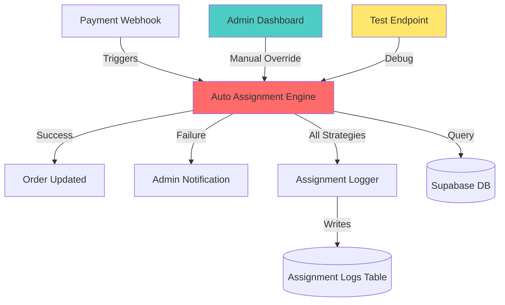
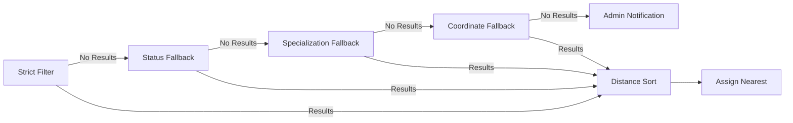

# Design Document: Teknisi Assignment System Improvements

## Overview

This design document outlines improvements to the FixIT technician assignment system to address critical failures in order-to-technician matching. The current system has three major failure points: (1) strict filtering criteria that exclude valid technicians, (2) no fallback mechanisms when auto-assignment fails, and (3) poor error handling in the payment webhook flow. The solution implements a multi-tiered fallback strategy in the assignment engine, adds manual assignment capabilities to the admin dashboard, provides debugging tools for administrators, enhances error handling and logging throughout the system, and adds optional database audit trails for assignment history.

### Core Problem Analysis

**Current Failure Modes:**
- Orders stuck in "menunggu" state when payment webhook succeeds but auto-assignment fails
- Technicians with null/zero coordinates are excluded from consideration
- No technicians found when specialization match requirements are too strict
- No status filtering fallback when no "tersedia" technicians exist
- Webhook failures result in lost orders with no admin notification
- No visibility into why assignment failures occur

**Design Philosophy:**
- Graceful degradation through fallback strategies
- Fail-safe error handling (always prefer a partially-assigned order over a lost order)
- Comprehensive logging and audit trails for debugging
- Manual override capabilities for edge cases
- Preserve backward compatibility with existing order flow

## Architecture

### System Components



### Layered Fallback Architecture



## Components and Interfaces

### 1. Enhanced AutoAssign Engine (`lib/autoAssign.ts`)

**Primary Responsibilities:**
- Execute multi-tiered filtering with fallback strategies
- Handle missing/invalid coordinate data gracefully
- Log each filtering step with detailed context
- Return structured error information for debugging

**Interface:**

```typescript
interface AutoAssignOptions {
  orderId: string
  enableFallbacks?: boolean  // Default: true
  maxDistance?: number       // Default: 999999 (km)
  logLevel?: 'debug' | 'info' | 'error'  // Default: 'info'
}

interface AutoAssignResult {
  success: boolean
  message: string
  assignedTechnicianId?: string
  distance?: number
  fallbacksUsed?: string[]      // e.g. ['status', 'specialization']
  techniciansConsidered?: number
  filterSteps?: FilterStep[]    // Detailed logs for debugging
}

interface FilterStep {
  step: string                  // e.g. 'strict_filter', 'status_fallback'
  techniciansFound: number
  criteria: Record<string, any>
  timestamp: string
}

// Main function signature
async function autoAssignTechnician(
  supabase: SupabaseClient, 
  options: AutoAssignOptions
): Promise<AutoAssignResult>
```

**Filtering Strategy Sequence:**

1. **Strict Filter** (Initial attempt)
   - Status: 'tersedia'
   - Profile: is_active = true
   - Specializations: Must match at least one required spec
   - Coordinates: Valid (non-null, non-zero)

2. **Status Fallback** (If strict returns 0 results)
   - Status: ANY active status ('tersedia' OR 'offline')
   - Profile: is_active = true  
   - Specializations: Must match at least one required spec
   - Coordinates: Valid (non-null, non-zero)
   - Log: "Status fallback applied: including non-tersedia technicians"

3. **Specialization Fallback** (If status fallback returns 0)
   - Status: ANY active status
   - Profile: is_active = true
   - Specializations: ANY (removed requirement)
   - Coordinates: Valid (non-null, non-zero)
   - Log: "Specialization fallback applied: ignoring specialization mismatch"

4. **Coordinate Fallback** (If specialization fallback returns 0)
   - Status: ANY active status
   - Profile: is_active = true
   - Specializations: ANY
   - Coordinates: Allow null/zero (assign maxDistance for sorting)
   - Log: "Coordinate fallback applied: including technicians with invalid coordinates"

5. **Final Failure** (If all fallbacks return 0)
   - Create admin notification
   - Set order status to 'menunggu' (not 'dikonfirmasi')
   - Return detailed error with all attempted strategies

**Coordinate Handling:**

```typescript
const DEFAULT_MAX_DISTANCE = 999999 // km

function calculateDistance(
  orderLat: number | null,
  orderLng: number | null,
  techLat: number | null,
  techLng: number | null,
  maxDistance: number = DEFAULT_MAX_DISTANCE
): number {
  // If any coordinate is null or zero, return maxDistance
  if (!orderLat || !orderLng || !techLat || !techLng) {
    return maxDistance
  }
  
  // Otherwise use Haversine formula
  return getDistance(orderLat, orderLng, techLat, techLng)
}
```

**Logging Strategy:**

```typescript
interface AssignmentLog {
  orderId: string
  timestamp: string
  filterSteps: FilterStep[]
  result: 'success' | 'failure'
  assignedTechnicianId?: string
  distance?: number
  fallbacksUsed: string[]
  errorMessage?: string
}

async function logAssignment(
  supabase: SupabaseClient,
  log: AssignmentLog
): Promise<void> {
  await supabase.from('assignment_logs').insert({
    order_id: log.orderId,
    filter_steps: log.filterSteps,
    result: log.result,
    assigned_technician_id: log.assignedTechnicianId,
    distance: log.distance,
    fallbacks_used: log.fallbacksUsed,
    error_message: log.errorMessage,
    created_at: new Date().toISOString()
  })
}
```

### 2. Manual Assignment UI Component

**Location:** `app/admin/orders/page.tsx` (modify existing)

**New UI Elements:**

1. **Technician Selection Dropdown** (shown when order status = 'menunggu')
   - Displays all active technicians (regardless of status)
   - Shows: full_name, status badge, specializations, current location
   - Sortable by: distance (if coordinates available), status, name

2. **Confirmation Dialog** (modal)
   - Displays selected technician details
   - Shows order details for context
   - Confirms assignment before executing
   - Warning if technician status is not 'tersedia'

**Component Structure:**

```typescript
interface TechnicianWithProfile {
  id: string
  full_name: string
  teknisi_profiles: {
    status: string
    specializations: string[]
    latitude: number | null
    longitude: number | null
  }
  distance?: number  // Calculated if order has coordinates
}

interface ManualAssignmentPanelProps {
  order: Order
  technicians: TechnicianWithProfile[]
  onAssign: (orderId: string, technicianId: string) => Promise<void>
  onCancel: () => void
}

function ManualAssignmentPanel({
  order,
  technicians,
  onAssign,
  onCancel
}: ManualAssignmentPanelProps) {
  const [selectedTech, setSelectedTech] = useState<string | null>(null)
  const [showConfirm, setShowConfirm] = useState(false)
  
  // Sort technicians: tersedia first, then by distance, then by name
  const sortedTechnicians = useMemo(() => {
    return [...technicians].sort((a, b) => {
      // Priority 1: Status (tersedia first)
      if (a.teknisi_profiles.status === 'tersedia' && b.teknisi_profiles.status !== 'tersedia') return -1
      if (a.teknisi_profiles.status !== 'tersedia' && b.teknisi_profiles.status === 'tersedia') return 1
      
      // Priority 2: Distance (if available)
      if (a.distance && b.distance) return a.distance - b.distance
      
      // Priority 3: Name
      return a.full_name.localeCompare(b.full_name)
    })
  }, [technicians])
  
  // UI implementation...
}
```

**Admin Dashboard Integration Points:**

```typescript
// In AdminOrdersPage component

const [assigningOrderId, setAssigningOrderId] = useState<string | null>(null)

async function handleManualAssign(orderId: string, technicianId: string) {
  setLoadingAssign(orderId)
  try {
    const supabase = createClient()
    
    // 1. Update order
    const { error: orderError } = await supabase
      .from('orders')
      .update({
        teknisi_id: technicianId,
        status: 'dikonfirmasi',
        scheduled_at: new Date().toISOString(),
      })
      .eq('id', orderId)
    
    if (orderError) throw orderError
    
    // 2. Update technician status
    await supabase
      .from('teknisi_profiles')
      .update({ status: 'bertugas' })
      .eq('id', technicianId)
    
    // 3. Create notifications (customer + technician)
    await createAssignmentNotifications(supabase, orderId, technicianId)
    
    // 4. Initialize chat session
    await initializeChatSession(supabase, orderId, technicianId)
    
    // 5. Log manual assignment
    await logAssignment(supabase, {
      orderId,
      timestamp: new Date().toISOString(),
      filterSteps: [{ step: 'manual_assignment', techniciansFound: 1, criteria: { manual: true }, timestamp: new Date().toISOString() }],
      result: 'success',
      assignedTechnicianId: technicianId,
      fallbacksUsed: ['manual'],
      errorMessage: undefined
    })
    
    toast.success('Teknisi berhasil dialokasikan secara manual')
    setAssigningOrderId(null)
    await fetchOrdersAndTechs()  // Refresh
    
  } catch (err: any) {
    toast.error(err.message || 'Gagal alokasi manual')
  } finally {
    setLoadingAssign(null)
  }
}
```

### 3. Test Assignment Endpoint

**Location:** `app/api/admin/test-assign/route.ts` (new file)

**Purpose:** Allow administrators to manually trigger auto-assignment for debugging

**API Specification:**

```typescript
// POST /api/admin/test-assign
// Body: { orderId: string, enableFallbacks?: boolean }
// Response: AutoAssignResult

export async function POST(request: Request) {
  try {
    const supabase = createAdminClient()
    
    // 1. Verify admin authentication
    const { data: { user } } = await supabase.auth.getUser()
    if (!user) {
      return NextResponse.json({ error: 'Unauthorized' }, { status: 401 })
    }
    
    const { data: profile } = await supabase
      .from('profiles')
      .select('role')
      .eq('id', user.id)
      .single()
    
    if (profile?.role !== 'admin') {
      return NextResponse.json({ error: 'Forbidden' }, { status: 403 })
    }
    
    // 2. Parse request body
    const body = await request.json()
    const { orderId, enableFallbacks = true } = body
    
    if (!orderId) {
      return NextResponse.json(
        { error: 'orderId is required' },
        { status: 400 }
      )
    }
    
    // 3. Verify order exists and is in 'menunggu' state
    const { data: order } = await supabase
      .from('orders')
      .select('id, status')
      .eq('id', orderId)
      .single()
    
    if (!order) {
      return NextResponse.json(
        { error: 'Order not found' },
        { status: 404 }
      )
    }
    
    if (order.status !== 'menunggu') {
      return NextResponse.json(
        { 
          error: `Order status is '${order.status}'. Only 'menunggu' orders can be assigned.`,
          currentStatus: order.status
        },
        { status: 400 }
      )
    }
    
    // 4. Trigger auto-assignment with detailed logging
    const result = await autoAssignTechnician(supabase, {
      orderId,
      enableFallbacks,
      logLevel: 'debug'
    })
    
    // 5. Return detailed result
    return NextResponse.json({
      success: result.success,
      message: result.message,
      assignedTechnicianId: result.assignedTechnicianId,
      distance: result.distance,
      fallbacksUsed: result.fallbacksUsed,
      techniciansConsidered: result.techniciansConsidered,
      filterSteps: result.filterSteps,
      timestamp: new Date().toISOString()
    })
    
  } catch (err: any) {
    console.error('Test assign error:', err)
    return NextResponse.json(
      { error: err.message || 'Internal server error' },
      { status: 500 }
    )
  }
}
```

**Admin UI Integration:**

Add a "Test Auto-Assign" button to admin orders page (for debugging):

```typescript
// In AdminOrdersPage, add button next to manual assign
<Button
  variant="outline"
  onClick={() => handleTestAssign(order.id)}
  className="text-xs"
>
  <Bug className="h-3.5 w-3.5 mr-1" />
  Debug Auto-Assign
</Button>

async function handleTestAssign(orderId: string) {
  try {
    const response = await fetch('/api/admin/test-assign', {
      method: 'POST',
      headers: { 'Content-Type': 'application/json' },
      body: JSON.stringify({ orderId, enableFallbacks: true })
    })
    
    const result = await response.json()
    
    if (result.success) {
      toast.success(result.message)
      // Show detailed debug info
      console.log('Auto-assign debug info:', result)
    } else {
      toast.error(result.message)
      console.error('Auto-assign failed:', result)
    }
    
    await fetchOrdersAndTechs()
  } catch (err: any) {
    toast.error(err.message)
  }
}
```

### 4. Enhanced Webhook Error Handling

**Location:** `app/api/payments/webhook/route.ts` (modify existing)

**Changes:**

```typescript
// In webhook POST handler, wrap auto-assignment in try-catch

if (isPaid) {
  let assignResult: AutoAssignResult | null = null
  
  try {
    // Attempt auto-assignment
    assignResult = await autoAssignTechnician(supabase, {
      orderId: payment.order_id,
      enableFallbacks: true,
      logLevel: 'info'
    })
    
    console.log('[Webhook] Auto-assign result:', assignResult)
    
    if (!assignResult.success) {
      // Assignment failed - create admin notification
      await supabase.from('notifications').insert({
        user_id: null,  // System notification for all admins
        title: 'Assignment Failed',
        body: `Order ${payment.order_id} paid but auto-assignment failed: ${assignResult.message}`,
        type: 'system',
        related_id: payment.order_id,
        created_at: new Date().toISOString()
      })
      
      // Keep order in 'menunggu' state for manual assignment
      await supabase
        .from('orders')
        .update({ status: 'menunggu' })
        .eq('id', payment.order_id)
    }
    
  } catch (assignError: any) {
    console.error('[Webhook] Auto-assign exception:', assignError)
    
    // Create admin notification for unexpected errors
    await supabase.from('notifications').insert({
      user_id: null,
      title: 'Assignment Error',
      body: `Order ${payment.order_id} paid but auto-assignment threw exception: ${assignError.message}`,
      type: 'system',
      related_id: payment.order_id,
      created_at: new Date().toISOString()
    })
    
    // Keep order in 'menunggu' state
    await supabase
      .from('orders')
      .update({ status: 'menunggu' })
      .eq('id', payment.order_id)
  }
}

// Always return 200 to Midtrans to prevent retries
return NextResponse.json({ 
  status: 'ok', 
  payment: finalPaymentStatus,
  assignment: assignResult ? {
    success: assignResult.success,
    message: assignResult.message
  } : null
})
```

**Key Improvements:**
1. Catch all exceptions from auto-assignment (don't let them fail the webhook)
2. Create admin notifications for both expected failures and unexpected exceptions
3. Always return 200 to payment gateway (prevents duplicate webhook retries)
4. Keep order in 'menunggu' state if assignment fails (enables manual intervention)
5. Log all assignment attempts with detailed context

### 5. Admin Notification Query

**Modify:** `app/admin/page.tsx` or create notification panel component

**Query System Notifications:**

```typescript
// Fetch system notifications (null user_id) for admins
const { data: systemNotifications } = await supabase
  .from('notifications')
  .select('*')
  .is('user_id', null)
  .eq('type', 'system')
  .order('created_at', { ascending: false })
  .limit(50)

// Display in admin dashboard with highlighting for unread
```

## Data Models

### Current Schema (No Changes Required)

The existing database schema already supports all required functionality:

- **profiles**: Contains user data including role
- **teknisi_profiles**: Contains technician-specific data (status, specializations, coordinates)
- **orders**: Contains order data with teknisi_id foreign key
- **notifications**: Can store both user-specific and system-wide notifications

### Optional: Assignment Logs Table (Recommended for Audit Trail)

**Create new table for detailed assignment history:**

```sql
-- Optional: Assignment audit log table
create table public.assignment_logs (
  id uuid primary key default gen_random_uuid(),
  order_id uuid references public.orders(id) on delete cascade not null,
  assigned_technician_id uuid references public.profiles(id) on delete set null,
  result text not null check (result in ('success', 'failure')),
  distance decimal(10,2),
  fallbacks_used text[],  -- e.g. ['status', 'specialization']
  filter_steps jsonb not null,  -- Detailed log of each filtering step
  error_message text,
  created_at timestamptz default now()
);

-- Index for querying by order
create index idx_assignment_logs_order_id on public.assignment_logs(order_id);

-- Index for querying by technician
create index idx_assignment_logs_technician_id on public.assignment_logs(assigned_technician_id);

-- RLS policies
alter table public.assignment_logs enable row level security;

-- Admins can view all logs
create policy "Admins can view assignment logs" 
  on public.assignment_logs for select 
  using (
    exists (select 1 from public.profiles where id = auth.uid() and role = 'admin')
  );

-- System can insert logs (service role)
create policy "System can insert assignment logs" 
  on public.assignment_logs for insert 
  with check (true);
```

**Benefits of Assignment Logs Table:**
- Full audit trail of all assignment attempts
- Debugging tool for understanding why assignments fail
- Analytics on fallback strategy usage
- Historical data for improving assignment algorithm

**Alternative (if table not created):**
- Use console.log for debugging (ephemeral)
- Store critical failures in notifications table only
- Less detailed historical analysis

## Error Handling

### Error Hierarchy

```typescript
class AssignmentError extends Error {
  constructor(
    message: string,
    public code: string,
    public details?: Record<string, any>
  ) {
    super(message)
    this.name = 'AssignmentError'
  }
}

// Specific error types
class NoTechniciansError extends AssignmentError {
  constructor(details: { filtersApplied: string[], techniciansChecked: number }) {
    super(
      'No technicians available after all fallback strategies',
      'NO_TECHNICIANS',
      details
    )
  }
}

class InvalidOrderError extends AssignmentError {
  constructor(orderId: string, reason: string) {
    super(
      `Order ${orderId} is invalid: ${reason}`,
      'INVALID_ORDER',
      { orderId, reason }
    )
  }
}

class DatabaseError extends AssignmentError {
  constructor(operation: string, originalError: any) {
    super(
      `Database operation '${operation}' failed: ${originalError.message}`,
      'DATABASE_ERROR',
      { operation, originalError }
    )
  }
}
```

### Error Handling Strategy

**In autoAssignTechnician:**
```typescript
try {
  // Attempt assignment
} catch (err) {
  if (err instanceof NoTechniciansError) {
    // Create admin notification
    // Return structured error response
    return {
      success: false,
      message: err.message,
      filterSteps: err.details.filtersApplied,
      techniciansConsidered: err.details.techniciansChecked
    }
  }
  
  if (err instanceof DatabaseError) {
    // Log critical error
    console.error('[AutoAssign] Database error:', err)
    // Return generic error (don't expose DB details)
    return {
      success: false,
      message: 'Database error occurred'
    }
  }
  
  // Unknown error
  console.error('[AutoAssign] Unexpected error:', err)
  return {
    success: false,
    message: 'Unexpected error occurred'
  }
}
```

**In Webhook:**
```typescript
try {
  const result = await autoAssignTechnician(...)
  // Handle result
} catch (err) {
  // NEVER throw - always catch and handle
  console.error('[Webhook] Assignment error:', err)
  
  // Create admin notification
  await createSystemNotification(...)
  
  // Set order to 'menunggu' for manual intervention
  await updateOrderStatus(orderId, 'menunggu')
  
  // Return 200 to prevent webhook retries
  return NextResponse.json({ status: 'ok' })
}
```

**In Manual Assignment UI:**
```typescript
try {
  await handleManualAssign(orderId, technicianId)
  toast.success('Assignment successful')
} catch (err: any) {
  // Show user-friendly error
  toast.error(err.message || 'Assignment failed')
  
  // Log for debugging
  console.error('[Manual Assign] Error:', err)
}
```

### Logging Levels

```typescript
enum LogLevel {
  DEBUG = 'debug',   // All filter steps, coordinate calculations
  INFO = 'info',     // Summary of fallbacks used, final result
  ERROR = 'error'    // Only errors and failures
}

function log(level: LogLevel, message: string, context?: any) {
  const timestamp = new Date().toISOString()
  const prefix = `[AutoAssign ${level.toUpperCase()}]`
  
  if (level === LogLevel.ERROR) {
    console.error(prefix, message, context)
  } else if (level === LogLevel.INFO) {
    console.log(prefix, message, context)
  } else if (level === LogLevel.DEBUG) {
    console.debug(prefix, message, context)
  }
}
```

## Testing Strategy

### Unit Tests

**Testing Library:** Jest + React Testing Library

**autoAssign.ts Unit Tests:**
1. Test strict filter returns correct technicians
2. Test status fallback triggers when no 'tersedia' technicians
3. Test specialization fallback triggers when no matching specializations
4. Test coordinate fallback handles null/zero coordinates
5. Test distance calculation with valid coordinates
6. Test distance calculation with invalid coordinates
7. Test final failure returns correct error structure
8. Test logging captures all filter steps
9. Test order update succeeds after assignment
10. Test technician status update succeeds after assignment
11. Test notification creation for customer and technician
12. Test chat initialization after assignment

**Manual Assignment Tests:**
1. Test manual assignment updates order status
2. Test manual assignment updates technician status
3. Test manual assignment creates notifications
4. Test manual assignment initializes chat
5. Test manual assignment with invalid order ID fails
6. Test manual assignment with invalid technician ID fails

**Webhook Tests:**
1. Test webhook continues after assignment failure
2. Test webhook creates admin notification on failure
3. Test webhook sets order to 'menunggu' on failure
4. Test webhook returns 200 even when assignment fails
5. Test webhook logs assignment result

**Test Endpoint Tests:**
1. Test endpoint requires admin authentication
2. Test endpoint requires valid order ID
3. Test endpoint only works with 'menunggu' orders
4. Test endpoint returns detailed debug information
5. Test endpoint triggers auto-assignment

### Integration Tests

**End-to-End Scenarios:**
1. Payment success → Auto-assignment success → Order dikonfirmasi
2. Payment success → Auto-assignment failure → Order menunggu → Manual assignment
3. Payment success → Auto-assignment uses status fallback → Order dikonfirmasi
4. Payment success → Auto-assignment uses specialization fallback → Order dikonfirmasi
5. Payment success → Auto-assignment uses coordinate fallback → Order dikonfirmasi
6. Admin triggers test-assign → Receives detailed debug info
7. Admin performs manual assignment → Order updated correctly

**Database Integration:**
1. Test assignment_logs table records all attempts
2. Test system notifications created for admins
3. Test order status transitions correctly
4. Test technician status transitions correctly

### Manual Testing Checklist

**Admin Dashboard:**
- [ ] Manual assignment dropdown shows all technicians
- [ ] Manual assignment confirmation dialog displays correctly
- [ ] Manual assignment success updates UI
- [ ] Manual assignment failure shows error toast
- [ ] Test auto-assign button triggers debug endpoint
- [ ] Test auto-assign shows detailed results

**Assignment Engine:**
- [ ] Create order with no matching technicians → Uses fallbacks
- [ ] Create order with technician with null coordinates → Assigns with max distance
- [ ] Create order when all technicians are 'offline' → Uses status fallback
- [ ] Verify detailed logs in console for each fallback

**Webhook Flow:**
- [ ] Mock payment success → Verify auto-assignment triggered
- [ ] Mock payment success + assignment failure → Verify order stays 'menunggu'
- [ ] Mock payment success + assignment failure → Verify admin notification created

## Notes

### Implementation Priority

**Phase 1 (Critical):**
1. Refactor autoAssign.ts with fallback strategies
2. Enhance webhook error handling
3. Add admin notifications for failures

**Phase 2 (Important):**
4. Add manual assignment UI to admin dashboard
5. Create test-assign endpoint

**Phase 3 (Optional but Recommended):**
6. Create assignment_logs table for audit trail
7. Add debug logging to admin dashboard

### Backward Compatibility

All changes are additive or internal refactoring:
- Existing autoAssign function signature remains compatible
- No breaking changes to database schema (assignment_logs is optional)
- No changes to customer-facing flows
- No changes to technician-facing flows

### Performance Considerations

**Query Optimization:**
- All technician queries should use database indexes on status and is_active
- Consider pagination if technician count grows large (currently not needed)
- Fallback queries are sequential (stop at first success) to minimize DB load

**Logging Volume:**
- Use INFO level logging in production to avoid log spam
- Use DEBUG level only when troubleshooting specific issues
- assignment_logs table will grow over time - consider archiving strategy after 1 year

### Security Considerations

**Test Endpoint:**
- Requires admin authentication (verified via Supabase auth)
- Only allows testing on 'menunggu' orders (prevents re-assignment)
- Logs all test-assign attempts for audit

**Manual Assignment:**
- Only visible to admin users
- All assignment attempts logged
- Cannot override orders that are already 'dikonfirmasi' or later stages

**Webhook:**
- Maintains existing Midtrans signature verification
- Never exposes internal errors to external webhook caller
- Always returns 200 to prevent retry loops
